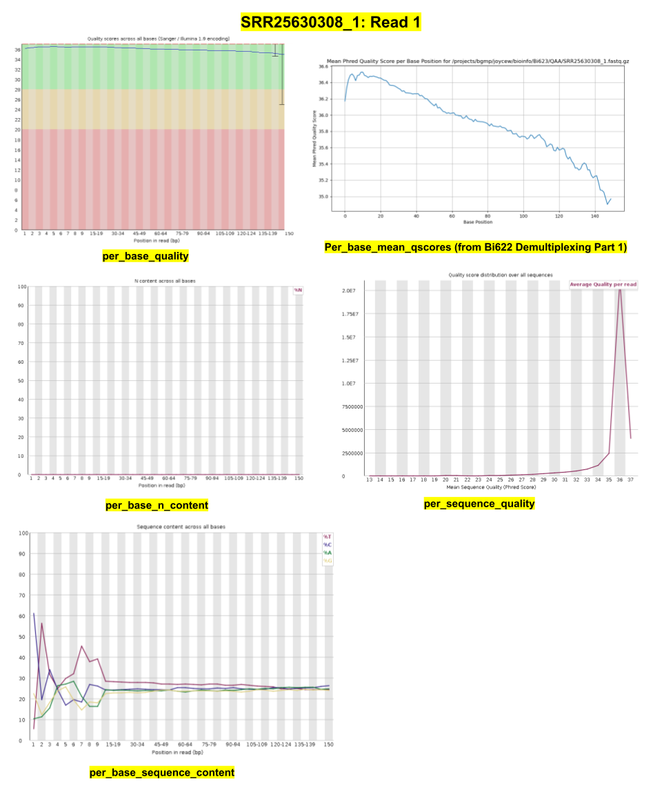
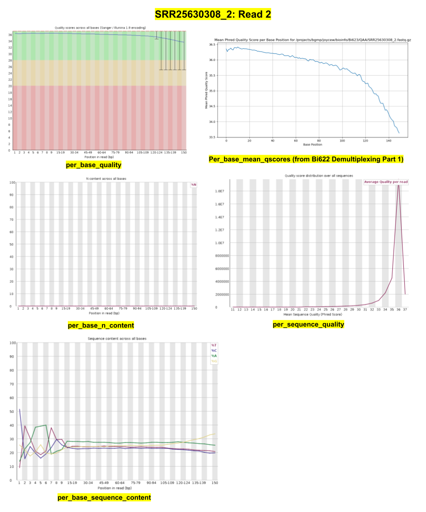
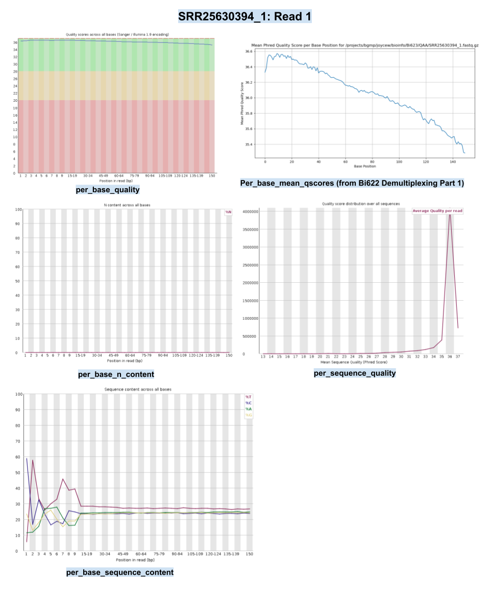
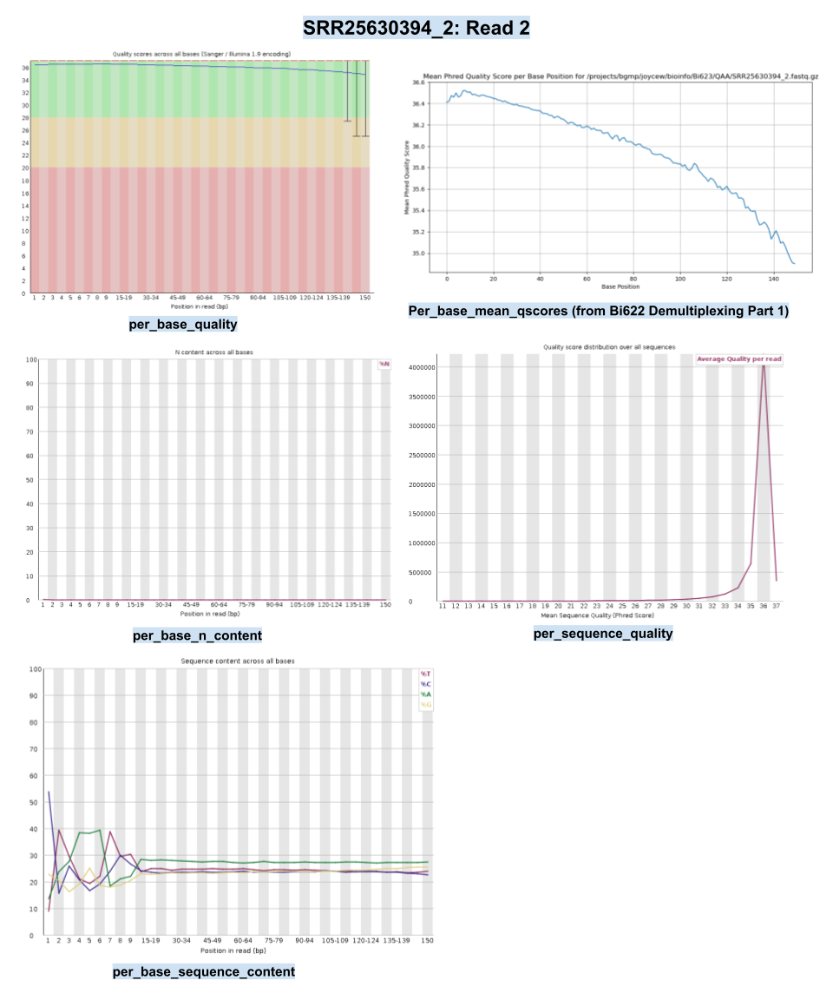
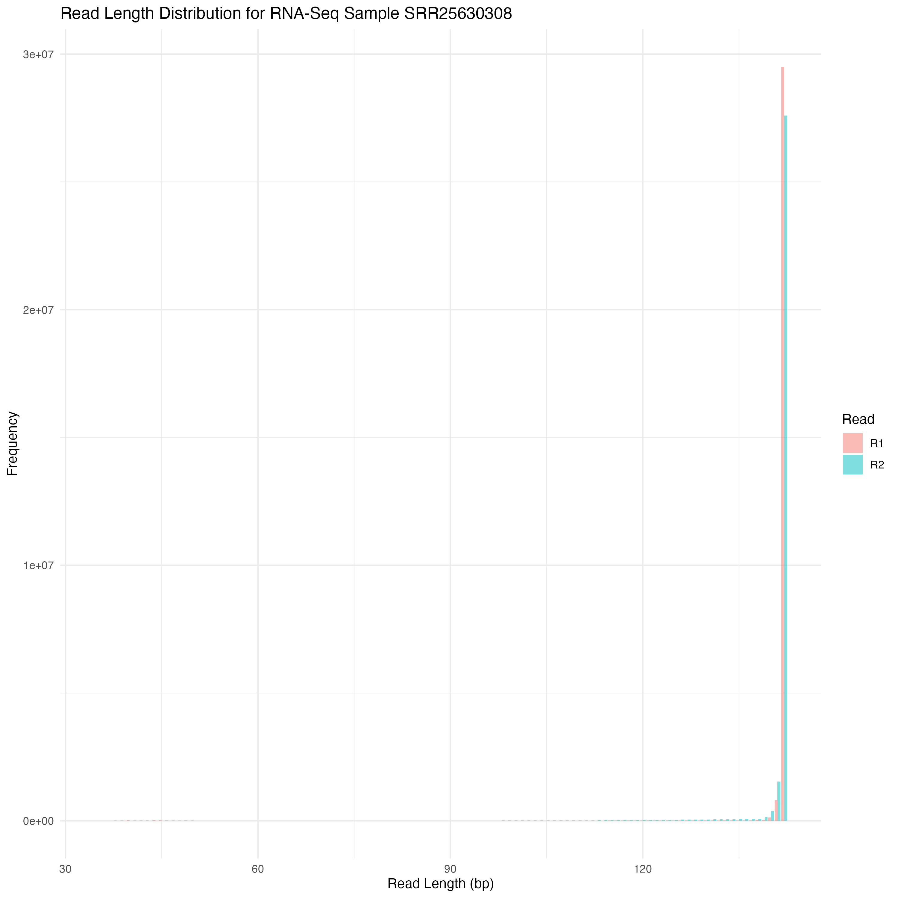
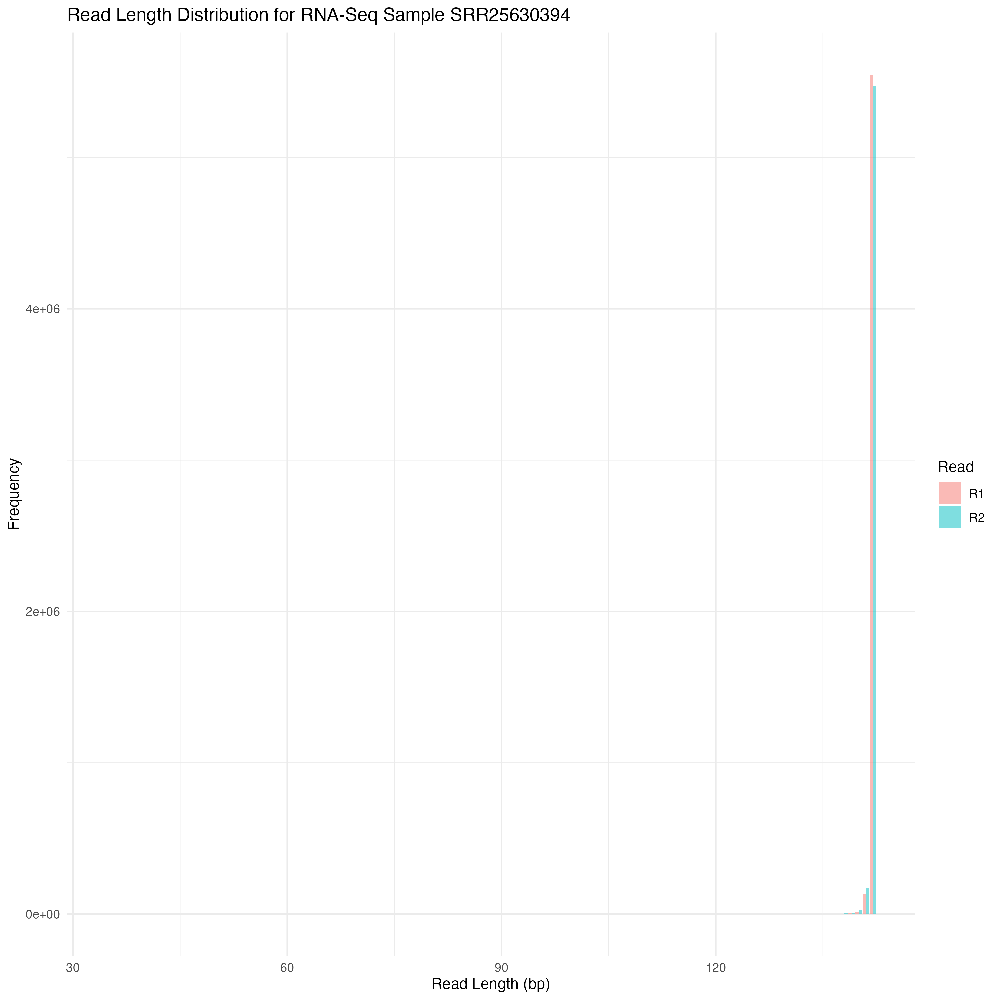

```{r setup, include=FALSE}
knitr::opts_chunk$set(echo = TRUE)
library(tinytex)
```

# Bi623 PS2: RNA-seq Quality Assessment Assignment (QAA)

## Objectives:

-   Process electric organ and/or skeletal muscle RNA-seq reads for a future differential gene expression analysis

-   Learn how to use existing tools for quality assessment and read trimming

-   Learn how to compare quality assessments to those created by my own software

-   Learn how to align and count reads

-   Learn how to summarize important information in a high-level report

-   PS2 works in tandem with PS4 for this pipeline:

    -   [PS2] Assess quality of reads --\> Trim reads --\> Align reads to genome/transcriptome --\> Count reads --\>\
    -   [PS4] Normalize reads counts --\> Identify differentially expressed genes

## Dataset:

-   This assignment involves using 2 RNA-seq files from two different electric fish studies.

-   The two RNA-seq libraries/samples I was given were: SRR25630308, and SRR25630394.

-   After getting the SRA files, I converted them into gzipped fastq files. These will be used in a later assignment.

    ```         
    # SRR25630308_1 Read 1: Cco_com124_EO_6cm_2_1.fastq.gz
    # SRR25630308_2 Read 2: Cco_com124_EO_6cm_2_2.fastq.gz
    # SRR25630394_1 Read 1: Crh_rhy115_EO_adult_1_1.fastq.gz
    # SRR25630394_2 Read 2: Crh_rhy115_EO_adult_1_2.fastq.gz
    ```

## Lab notebook:

-   My lab notebook, `Bi623_PS2_lab_notebook.md`, documents this entire assignment and contains nearly all code, scripts and bash commands used.

## Part 1: FastQC, plotting per-base mean qscores, and assessing reads quality:

-   After running FastQC on all four files (two reads, forward and reverse, for each of the two samples), I produced several plots that could help me assess the overall reads quality and determine if I should use these to proceed with the next steps involved in a differential gene expression analysis.

    -   The plots I took a close look at were:

        -   per_base_quality

        -   per_base_n_content

        -   per_sequence_quality

        -   per_base_sequence_content

-   I also ran my own quality score plotting script from the Demultiplexing assignment in Bi622 to produce per-base mean qscore plots. This was compared directly with the per_base_quality plots produced by FastQC.

-   The following images include all 5 plots for each read of a sample. I used Google Slides to put these plots together.

    

    

    

    

### Compare per-base N content with per-base quality score:

-   This step asks me to compare the per-base N content plots and the per-base quality score plots for R1 and R2 of each sample, and see if they are consistent. If there is a drop in the per-base quality score, there should be a corresponding increase in N content in those same regions. Otherwise, if the quality scores are consistently high, the N content should remain very low and unchanging. Across both samples, and for both Reads 1 and 2 for SRR25630308 and SRR25630394, the per-base N content plots and per-base quality score plots are pretty consistent. Since both reads for both samples have very high quality scores overall, all the per-base N content plots look similar-- with a horizontal line at essentially 0 N content across all bases. This means there are very few gaps in the reads, and that the slight drops in quality scores as the base pair region increases across all reads are not because of gaps.

### Describe how the FastQC quality score distribution plots compare to mine. Also, does the runtime differ? Mem/CPU usage?

-   The FastQC quality score distribution plots are very similar compared to my own. I tried to track peaks and dips in quality scores, and for all both reads in both RNA-Seq samples, the quality score trends were similar and there were no discrepancies between which base pair positions in the reads experienced increases or decreases in quality scores. This makes sense, since both are using Phred quality scores from the same FASTQ files. The y-axis on my demultiplexing script is much more zoomed in for all plots, however, which allows the user to track read quality scores per base pair more efficiently, whereas the FASTQC quality score plots give the users an overarching idea of how good each read is by indicating where each base position sits in terms of high, mediocore, or low quality scores.

-   The runtimes between my demultiplexing script and FASTQC differ, as my script took longer on average for all four files. The FASTQC jobs took a higher percentage of CPU. My script, written in Python, was slower since it read through the FASTQ file line by line and stored scores in lists. The FASTQC command was faster but more computationally intensive since it keeps a lot more data structures in memory for additional quality report metrics beyond per-base qscore plots.

### Comment on the overall data quality of the two libraries, going beyond per-base qscore distributions. Make and justify a recommendation on whether these data are of high enough quality to use for further analysis:

-   Looking at only the per-base qscore distributions, both libraries have high data quality. Going beyond these plots, I also looked at per-base sequence quality plots, and per-base sequence content plots to assess the overall data quality of the two libaries, SRR25630308 and SRR25630394.

-   For both read 1 and read 2 of the two libaries, the per-base sequence quality plots indicate most base pairs have a mean Phred quality score of around 33-36. This points to good quality reads that are usable for next steps, such as *trimming, genome alignment, counting reads, and identifying differentially expressed genes.* To confirm this, I also observed the per-base sequence content plots, which compares the proportion of the four DNA bases for each base position. For both the forward and reverse reads of SRR25630308 and SRR25630394, there is a lot of deviation between the proportion of A, T, C, and G in the first \~10 bp. Then, the four lines representing the DNA bases start mostly running in parallel with each other as the base pair number increases. This is expected of some types of libraries. RNA-Seq libraries in particular will always produce biased sequence composition near the start of the read ([https://www.bioinformatics.babraham.ac.uk/projects/fastqc/Help/3 Analysis Modules/4 Per Base Sequence Content.html](https://www.bioinformatics.babraham.ac.uk/projects/fastqc/Help/3%20Analysis%20Modules/4%20Per%20Base%20Sequence%20Content.html)), and this is due to the fact that RNA-Seq libraries were produced by priming using random hexamers. These intrinsic biases in the positions at the start of the reads cannot be corrected by cutadapt trimming, but usually doesn't affect downstream analysis, so it's still safe to use these reads from the libraries SRR25630308 and SRR25630394 for the next steps of the differential gene expression analysis pipeline.

## Part 2: Adapter trimming:

### Try to determine what the adapters are on my own:

-   I struggled with this and ended up using Cutadapt with the given forward and reverse adapter sequences.

### Use Unix to search for the adapter sequences in the datasets and confirm the expected orientation:

-   I used zgrep -c first to grep for the forward and reverse adapter sequences given to us by Hope. These results confirmed the adapter sequences as well as the expected sequence orientations, since I got reads when I searched for the forward adapter in the forward reads, and when I searched for the reverse adapter in the reverse reads, for both RNA-seq samples.

```         
# SRR25630308_1: R1 adapter
zgrep -c "AGATCGGAAGAGCACACGTCTGAACTCCAGTCA" SRR25630308_1.fastq.gz
2485944

# SRR25630308_2: R2 adapter
zgrep -c "AGATCGGAAGAGCGTCGTGTAGGGAAAGAGTGT" SRR25630308_2.fastq.gz  
876639

# SRR25630394_1: R1 adapter
zgrep -c "AGATCGGAAGAGCACACGTCTGAACTCCAGTCA" SRR25630394_1.fastq.gz
71909

# SRR25630394_2: R2 adapter
zgrep -c "AGATCGGAAGAGCGTCGTGTAGGGAAAGAGTGT" SRR25630394_2.fastq.gz  
20218
```

### Trim adapter sequences with Cutadapt and report what proportion of reads (both R1 and R2) were trimmed:

-   For the SRR25630308 RNA-Seq sample:

    -   Read 1 with adapter: 8,258,276 (25.9%)

    -   Read 2 with adapter: 8,257,237 (25.9%)

-   For the SRR25630394 RNA-Seq sample:

    -   Read 1 with adapter: 458,160 (7.8%)

    -   Read 2 with adapter: 496,990 (8.4%)

### Do the trimmed reads have adapter sequences left over?

-   I used zgrep -c again to grep for the forward and reverse adapter sequences after running cutadapt. As expected, these files have 0 counts of the adapter sequences because they were trimmed away.

```         
# SRR25630308_1 trimmed: R1 adapter
zgrep -c "AGATCGGAAGAGCACACGTCTGAACTCCAGTCA" SRR25630308_1.trimmed.fastq.gz
0

# SRR25630308_2 trimmed: R2 adapter
zgrep -c "AGATCGGAAGAGCGTCGTGTAGGGAAAGAGTGT" SRR25630308_2.trimmed.fastq.gz  
0

# SRR25630394_1 trimmed: R1 adapter
zgrep -c "AGATCGGAAGAGCACACGTCTGAACTCCAGTCA" SRR25630394_1.trimmed.fastq.gz
0

# SRR25630394_2 trimmed: R2 adapter
zgrep -c "AGATCGGAAGAGCGTCGTGTAGGGAAAGAGTGT" SRR25630394_2.trimmed.fastq.gz  
0
```

### Summary of how I confirmed expected orientations of the reads and checked if adapter sequences were trimmed:

-   I used zgrep -c first to grep for the forward and reverse adapter sequences given to us by Hope and saw several counts of R1 and R2 adapters in R1 and R2 files for both samples, respectively. As stated above, these results confirmed the adapter sequences as well as the expected sequence orientations, since I got reads when I searched for the forward adapter in the forward reads, and when I searched for the reverse adapter in the reverse reads, for both RNA-seq samples. After using zgrep -c again for the two adapter sequences after running cutadapt, however, I saw that these files have 0 counts of the adapter sequences, as cutadapt trimmed those away.

## Part 2: More trimming with Trimmomatic:

-   I used Trimmomatic to quality trim the reads after cutting away the adapters.
-   Then, I plotted the trimmed read length distributions for both paired R1 and paired R2 reads (on the same plot), for the two RNA-seq samples.

### Trimmed read length distributions plots:





### Discuss whether R1s are trimmed more extensively than R2s, or vice versa. Comment on whether we expect R1s and R2s to be adapter-trimmed at different rates and why.

-   The read length histograms for each RNA-Seq sample show nearly overlapping R1 and R2 distributions—I avoided having the plots completely overlap by using position = "dodge" in ggplot2. This indicates that neither read direction was trimmed significantly more than the other. Both samples retained similar overall shapes with for both R1 and R2, suggesting minimal adapter contamination in either R1 or R2 for SRR25630308 and SRR25630394. This outcome is expected because the insert sizes were likely long enough relative to the sequencing read length (150 bp) for both R1 and R2, so that adapters appeared and were trimmed at similar rates in both read directions. After adapter trimming, the read length distributions reflect the biological sequences without bias from leftover adapter sequences.

## Part 3: Align reads to a genome and determine strand-specificity:

-   Align reads to the genome (not a transcriptome) next.

-   This step also gives information on quality:

    -   Contamination: what percent of the reads map to the genome/transcriptome?

-   Aligner: STAR: Spliced Transcripts Alignment to a Reference (align RNA-seq reads to a reference genome)

-   Evaluator of alignment: Picard

-   First, Use code from Bi621's PS8 to generate genome indexes, and then to map/align reads to the genome.

-   Then, remove PCR duplicates using Picard MarkDuplicates.

-   After using another script from Bi621's PS8, report the number of mapped and unmapped reads from each of the 2 aligned sam files, for each sample, post de-duplication Picard step.

### **Mapped and Unmapped Reads Counts for Aligned Reads:**

| Sample      | Mapped Reads | Unmapped Reads |
|-------------|--------------|----------------|
| SRR25630308 | 21839114     | 19106563       |
| SRR25630394 | 6672478      | 1302451        |

-   Then, count deduplicated reads that map to features using htseq-count. After running htseq-count:

-   Demonstrate whether or not the data are from "strand-specific" RNA-Seq libraries and which stranded= parameter should be used for counting the reads for a future differential gene expression analyses. Include any commands/scripts used.

### Based off what we know about the kit used for library prep and the htseq-count tool, what strand= parameter should we use? Discuss strand specificity.

-   The kit used during library preparation for the RNA-Seq libraries of both SRR25630308 and SRR25630394 is called "NEXTFLEX Rapid Directional RNA-seq 2.0", and it is considered a more modern technique for RNA-seq. The company website states that the libraries produced with this technology are stranded, and that dUTP is incorporated during the second strand synthesis step. Since the strand containing dUTP is not amplified during library amplification, this kit also retains the original strands' orientations (Source: <https://www.revvity.com/product/nex-rapid-dir-rna-seq-kit-2-0-8rxn-nova-5198-01>). This determines that the data we are using are strand-specific RNA-Seq libraries. Also, based on the paper provided in the instructions by Krishna et al., kits that use first strand cDNA libraries that mark dUTP in the second strand require `--s reverse` for the `htseq-count` tool's stranded option (Source: Krishna A Srinivasan, Suman K Virdee, Andrew G McArthur, Strandedness during cDNA synthesis, the stranded parameter in htseq-count and analysis of RNA-Seq data, Briefings in Functional Genomics, Volume 19, Issue 5-6, September-November 2020, Pages 339–342, <https://doi.org/10.1093/bfgp/elaa010>). Thus, we should use the `stranded=reverse` parameter for counting the reads for future differential gene expression analyses.
-   To prove this, we are going to count the reads from all four files (each sample with htseq-count ran with stranded=reverse AND stranded=yes) and compare the percentage of reads that mapped to a feature (gene) for each file, using code from Bi621's ICA4.

### After calculating the percentage of reads that mapped to a feature (gene) for each sample's count files (both with stranded=reverse and stranded=yes), what strand= parameter should we use? Discuss strand specificity.

#### Percent of Reads that Mapped to a Feature for Each Sample:

| Sample      | s= Parameter Setting | Percent of Reads that Mapped to a Feature |
|------------------|-----------------------|-------------------------------|
| SRR25630308 | reverse              | 30.8%                                     |
| SRR25630308 | yes                  | 1.8%                                      |
| SRR25630394 | reverse              | 51.9%                                     |
| SRR25630394 | yes                  | 2.9%                                      |

-   For SRR25630308, `stranded=reverse` assigned 30.8% of reads to features while `stranded=yes` assigned 1.8%. For SRR25630394, `stranded=reverse` assigned 51.9% vs. `stranded=yes` 2.9%. That means for both SRR25630308 and SRR25630394 RNA-seq libraries, the count files that had more reads mapping to features (or genes) was where `htseq-count` used the `stranded=reverse` option.
-   I propose that these data are strand-specific, because the majority of reads mapped to features only when using `stranded=reverse`. This large discrepancy indicates that the libraries are directional and affirms my earlier decision that the read counts file we should use are the ones where the stranded parameter is set to reverse.
-   We can then use `SRR25630308_reverse.count` and `SRR25630394_reverse.count` PS4's downstream analysis, where we will normalize the reads counts and identify differentially expressed genes in a DEG analysis.
